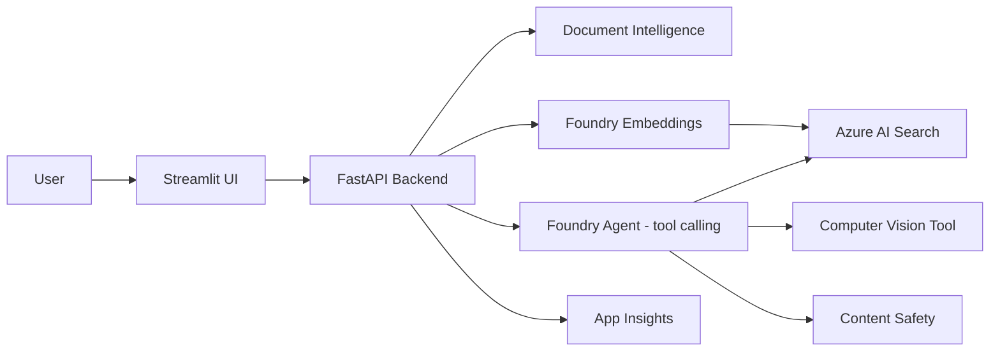

# DocuAgent

An agentic RAG assistant built on **Azure AI Foundry**, combining generative AI, tool/function calling, information extraction, computer vision, and text analysis into a single working system.

Upload a document, ask questions about it in natural language, and the agent autonomously decides when to search the document index, analyze an image, or answer directly — grounding its responses in retrieved content rather than hallucinating.

## Why this project

Most Azure AI demo projects are a thin wrapper around a single service call. This one is built around an **agent that reasons and calls tools** — search, vision, safety checks — deciding at runtime what it actually needs, which is closer to how these solutions get built in production.

## Architecture



**Flow:**
1. A document (PDF/image) is uploaded and sent to **Azure AI Document Intelligence**, which extracts text, layout, and tables.
2. Extracted text is chunked and embedded via an **Azure AI Foundry** embedding deployment, then indexed into **Azure AI Search** (vector + keyword hybrid).
3. A user question goes through **Azure AI Content Safety**, then to a **Foundry agent** with function-calling tools:
   - `search_documents` — hybrid retrieval over the indexed content
   - `analyze_image` — computer vision captioning/OCR for image inputs
4. The agent autonomously decides which tool(s) to call, incorporates the results, and produces a grounded, cited answer — which is safety-checked again before returning.
5. All requests are traced via **Application Insights** (Azure Monitor OpenTelemetry).

## Services used

| Service | Role | Tier used |
|---|---|---|
| Azure AI Foundry (AIServices) | Chat model (`gpt-5.4-mini`) + embeddings (`text-embedding-3-small`) | Standard / GlobalStandard |
| Azure AI Document Intelligence | Layout/text/table extraction | F0 (free) |
| Azure AI Search | Hybrid vector + keyword index | Free |
| Azure AI Content Safety | Input/output moderation | F0 (free) |
| Azure AI Speech | (optional) voice input/output | F0 (free) |
| Azure Key Vault | Secrets management | Standard |
| Application Insights / Log Analytics | Observability & tracing | Pay-as-you-go, negligible at this scale |

Auth is handled entirely via **Microsoft Entra ID (RBAC) and managed identity / `DefaultAzureCredential`** — no API keys are stored or used in application code.

## Repo structure

```
docuagent/
├── infra/                  # Bicep IaC for every Azure resource
│   ├── main.bicep
│   └── modules/
├── backend/
│   ├── app/
│   │   ├── main.py             # FastAPI entrypoint
│   │   ├── ingestion/          # Document Intelligence + chunking/embeddings
│   │   ├── retrieval/          # Azure AI Search index + hybrid query
│   │   ├── agent/              # Foundry agent with tool/function calling
│   │   ├── tools/               # Vision tool callable by the agent
│   │   └── safety/              # Content Safety gating
│   ├── requirements.txt
│   └── tests/                  # Mocked unit tests, no live Azure calls needed
├── frontend/
│   └── streamlit_app.py
├── .github/workflows/ci.yml     # Lint + test on push
└── docs/
```

## Prerequisites

- Azure subscription with access to Azure AI Foundry / Azure OpenAI models
- Azure CLI (`az`) logged in with an account that has Contributor + User Access Administrator (or equivalent) on the target resource group
- Python 3.11+
- `git`

## Setup

### 1. Provision infrastructure

```bash
az login
az account set --subscription "<your-subscription>"
az group create --name rg-documentagent --location eastus

az deployment group create \
  --resource-group rg-documentagent \
  --template-file infra/main.bicep \
  --parameters baseName=docuagent deployOpenAI=true
```

Grab the outputs:
```bash
az deployment group show -g rg-documentagent -n main --query properties.outputs
```

### 2. Grant yourself the required RBAC roles

```bash
OBJECT_ID=$(az ad signed-in-user show --query id -o tsv)

FOUNDRY_ID=$(az cognitiveservices account show --name <foundry-name> --resource-group rg-documentagent --query id -o tsv)
az role assignment create --assignee $OBJECT_ID --role "Cognitive Services OpenAI User" --scope $FOUNDRY_ID

DOCINTEL_ID=$(az cognitiveservices account show --name <docintel-name> --resource-group rg-documentagent --query id -o tsv)
az role assignment create --assignee $OBJECT_ID --role "Cognitive Services User" --scope $DOCINTEL_ID

SEARCH_ID=$(az search service show --name <search-name> --resource-group rg-documentagent --query id -o tsv)
az role assignment create --assignee $OBJECT_ID --role "Search Index Data Contributor" --scope $SEARCH_ID
az role assignment create --assignee $OBJECT_ID --role "Search Service Contributor" --scope $SEARCH_ID
```

> RBAC role assignments can take a couple of minutes to propagate. If you get `Forbidden` right after assigning, wait and retry before assuming something's misconfigured.

Azure AI Search must also have AAD auth enabled (not API-key-only):
```bash
az search service update \
  --name <search-name> \
  --resource-group rg-documentagent \
  --auth-options aadOrApiKey \
  --aad-auth-failure-mode http403
```

### 3. Configure environment

```bash
cd backend
cp .env.example .env
```

Fill in `.env` with the real endpoints from the Bicep outputs. Double check:
- `AZURE_FOUNDRY_DEPLOYMENT` matches your **actual** chat deployment name (verify with `az cognitiveservices account deployment list`) — model availability varies by region/quota and may not match the default in this repo.
- Endpoints have no trailing path segments beyond the base `https://<name>.cognitiveservices.azure.com/`.

### 4. Run locally

```bash
python -m venv .venv
source .venv/bin/activate        # Windows: .venv\Scripts\activate
pip install -r requirements.txt
uvicorn app.main:app --reload --port 8000
```

In a second terminal:
```bash
cd frontend
pip install streamlit requests
streamlit run streamlit_app.py
```

### 5. Test it

A sample multi-page test PDF (`sample_it_policy.pdf`) is included in `tests/sample/` — it has headings, a table, and FAQ-style content, useful for exercising every stage of the pipeline (layout extraction, table parsing, and RAG grounding).

Try:
- Upload the PDF via the Streamlit UI or `POST /ingest`
- Ask: *"What is the maximum home internet reimbursement?"* → should answer $45 and reference page 2
- Ask: *"What monitor model is provided to remote employees?"* → validates table extraction specifically
- Ask: *"Can I access customer data from my personal laptop?"* → validates security-section retrieval


## Running tests

```bash
cd backend
PYTHONPATH=. pytest ../tests
```

Tests mock all Azure SDK calls, so CI doesn't need live credentials or resources.

## Troubleshooting notes (from real debugging on this project)

- **`404 Resource not found` on embeddings/chat calls** — almost always a deployment-name mismatch between what's actually deployed (`az cognitiveservices account deployment list`) and what's in `.env`, or an `api_version` string that's actually a model version by mistake. API version and model version are different values — don't swap them.
- **`Forbidden` on Azure AI Search calls** — check that `disableLocalAuth` / `authOptions` allow AAD auth (`aadOrApiKey`, not `apiKeyOnly`), and that the identity has both `Search Service Contributor` (to manage the index schema) and `Search Index Data Contributor` (to read/write documents).
- **Deployed model version not available in your region** — check `az cognitiveservices account list-models` before assuming a Bicep failure; Azure will sometimes substitute or reject unavailable model/version combinations per region and quota.

## What's next

- Multi-agent orchestration (a router agent delegating to specialist sub-agents)
- Evaluation/tracing harness (groundedness, relevance scoring) via Azure AI Foundry evaluation SDK
- Bing grounding tool for open-web fallback when document search returns no relevant hits
- Speech-to-text/text-to-speech voice loop in the frontend
- CI/CD deployment to Azure Container Apps

## License

MIT
